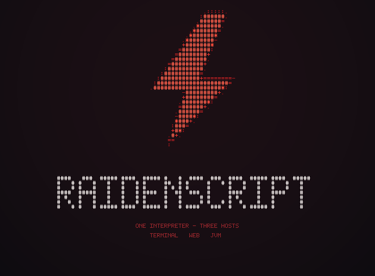

<p align="center">
  
</p>

<p align="center">
  <em>That bolt is ASCII characters, and the image of it was computed pixel by
  pixel — both by the same RaidenScript program,
  <a href="demo/kapak/kapak-ascii.rai">demo/kapak/kapak-ascii.rai</a>. No graphics
  library, in the program or in the language. The raw text is in
  <a href="demo/kapak/cover.txt">cover.txt</a>; a second, shaded version lives in
  <a href="demo/kapak/kapak.rai">kapak.rai</a>.</em>
</p>

# RaidenScript

**RaidenScript** (**RS**) is a small embeddable scripting language written from
scratch in C++20. You can write standalone programs with it, but its real purpose
is to go *inside* another application and make it programmable: weapons in a game,
rules on a game server, the logic of a web page.

The same interpreter currently runs in three hosts:

| Host | How | Proof in this repo |
|---|---|---|
| **Terminal** | native binary | `rai program.rai` |
| **Browser** | C API → WebAssembly (emscripten) | [`demo/site`](demo/site) — an animated store |
| **JVM** | C API → JNI | [`demo/plugin`](demo/plugin) — a Minecraft plugin |

> **Status: Phase 1 complete; Phases 4–6 (embedding) working.**
> Lexer, parser, resolver, tree-walking interpreter and REPL all work. Static
> types (Phase 2) and a bytecode VM (Phase 3) are deliberately skipped for now.
> Expect breaking changes before v1.0.

---

## Table of contents

1. [Install and build](#1-install-and-build)
2. [Your first program](#2-your-first-program)
3. [Command line](#3-command-line)
4. [Language guide](#4-language-guide)
5. [Standard library](#5-standard-library)
6. [Embedding — the point of the language](#6-embedding--the-point-of-the-language)
7. [Demos](#7-demos)
8. [Known limits and gotchas](#8-known-limits-and-gotchas)
9. [Design goals and non-goals](#9-design-goals-and-non-goals)

---

## 1. Install and build

You need a C++20 compiler and `make`. On Windows this project is developed with
[w64devkit](https://github.com/skeeto/w64devkit) (gcc 16, make 4.4) — a single
folder, no installer.

```bash
git clone https://github.com/RaidenTechnology/raidenscript
cd raidenscript
make                 # -> build/rs.exe
make test            # C API test suite
make install         # optional: installs the `rai` command
```

On Windows you can also run `build.ps1`, which finds the toolchain itself and
sets `PATH` **for that session only** — it never touches your system `PATH`.

Optional targets:

```bash
make wasm                          # -> dist/raidenscript.js + .wasm   (needs emsdk)
make jni JDK_HOME=/path/to/jdk21   # -> dist/raidenscript.dll
```

> **Trap:** if `w64devkit\bin` is not on `PATH`, g++ cannot find its own
> assembler and fails with `cannot execute 'as'`. Use `build.ps1`, or put the
> folder on `PATH` for the session.

---

## 2. Your first program

```python
# hello.rai
fn greet(name: str) -> str:
    return f"Hello {name}"

print(greet("world"))
```

```bash
rai hello.rai
# Hello world
```

Run `rai` with no arguments for a REPL.

### Errors are meant to be read

Diagnostics are a first-class feature, not an afterthought. Given this:

```python
fn f(x):
    return x!
```

you get:

```
hata: beklenmeyen '!'
 --> hello.rai:2:13
  |
2 |     return x!
  |             ^
  |
  = ipucu: olumsuzlama için 'not' kullan

1 hata
```

Position, the source line, a caret under the exact column, and a hint.

> **Note:** diagnostics are currently printed in **Turkish** (`hata` = error,
> `ipucu` = hint). English messages are on the roadmap. The keywords themselves
> are English.

---

## 3. Command line

```
rai <file.rai>          run a file
rai run <file.rai>      the same, explicit
rai                     start the REPL
rai --version
rai --help

DEVELOPMENT:
rai tokens <file.rai>   token dump
rai ast <file.rai>      syntax tree dump
rai coz <file.rai>      name resolution only — a fast syntax/name check
rai tani <file.rai>     show the diagnostics engine on a file
```

`rai coz` is the one to remember: it parses and resolves without running, so it
is the fastest way to check a script that needs a host in order to execute.

---

## 4. Language guide

### 4.1 Values and truthiness

Types: `int`, `f64`, `str`, `bool`, `nil`, list, map, function, class instance.

**Only `nil` and `false` are falsy.** `0` and `""` are truthy — the Lua/Ruby
model. This is deliberate: it removes the classic `if count:` bug where "empty"
and "zero" become indistinguishable.

```python
if 0:
    print("this runs")        # yes, it does
```

### 4.2 Variables and scope

Assignment creates a local. To assign to a variable from an enclosing scope
(including module level) you must say `outer` — shadowing is never silent:

```python
total = 0

fn add(n):
    outer total = total + n     # without `outer` this would create a local
```

### 4.3 Strings

```python
name = "Raiden"
n = 3
print(f"{name} has {n} items")      # f-strings interpolate any expression
print(f"{n * 2}", f"{name.upper()}")

s = "a,b,c"
s.split(",")            # ["a", "b", "c"]
s.replaceAll(",", "-")  # "a-b-c"
s.contains("b")         # true
s.indexOf("b")          # 2
s[0]                    # "a"   — indexing gives a one-character string
len(s)                  # 5     — characters, not bytes (UTF-8 aware)
```

### 4.4 Collections

```python
l = [3, 1, 2]
l.push(9)
l.pop()                       # 9
l.map((x) => x * 2)           # [6, 2, 4]
l.filter((x) => x > 1)        # [3, 2]
l.reduce((a, b) => a + b, 0)  # 6
["a", "b"].join("-")          # "a-b"

m = { "hp": 100, "name": "Raiden" }
m["hp"] = m["hp"] - 10
m.keys()                      # ["hp", "name"]
for k in m.keys():
    print(k, m[k])
```

> **Lambda parameters must be parenthesised:** `(x) => x * 2`, not `x => x * 2`.

### 4.5 Control flow

```python
if hp <= 0:
    print("dead")
elif hp < 20:
    print("hurt")
else:
    print("fine")

while i < 10:
    i = i + 1

for item in items:
    print(item)

for i in range(0, 10, 2):
    print(i)

for i in 0 .. 5:      # range expression; `..=` includes the end
    print(i)
```

Conditional expression (right-associative):

```python
label = "big" if n > 20 else "small"
```

### 4.6 Functions

```python
fn add(a: int, b: int) -> int:
    return a + b

# multi-line lambda
handler = (event) => {
    log(event.name)
    return event.damage * 2
}
```

Type annotations are optional everywhere (gradual typing). Today they are
documentation plus resolver checks; a full type checker is Phase 2.

### 4.7 Classes and traits

```python
trait Drawable:
    fn draw(self, painter)

class Entity:
    hp: int = 100
    fn init(self, name):
        self.name = name
    fn hello(self) -> str:
        return f"I am {self.name}"

class Ship(Entity):
    fn init(self, name, hp):
        super.init(name)
        self.hp = hp
    fn hello(self) -> str:
        return f"{super.hello()} ({self.hp} hp)"

print(Ship("Raiden", 100).hello())    # I am Raiden (100 hp)
```

> **Gotcha:** a class body cannot be just `pass`. It needs at least one field or
> method.

### 4.8 Errors

Everything you `throw` must derive from `Error`, which is a real class you can
subclass.

```python
class NotEnoughCredit(Error):
    code: int = 7

try:
    throw NotEnoughCredit("30 credits short")
catch e:
    print("caught:", e.message)
finally:
    print("always runs")
```

### 4.9 `import` vs `include`

Two keywords for pulling code in. The difference is **when they are resolved** —
something a compiler can actually enforce, unlike a style guide:

| | `import` | `include` |
|---|---|---|
| Resolved | at runtime | when the host builds you in |
| Sources | `std.*`, a git repo, `@ "v0.3.1"` | static bindings the host compiled in |
| Quoted paths | allowed | **rejected** |
| Version tags | allowed | **rejected** |

```python
include serial          # hardware binding, provided by the host
import std.math         # resolved at runtime
import std.json as j
```

On an ESP32 there is no filesystem and nothing to fetch, so a dependency that
needs the network at load time simply *cannot* be an `include`. Hardware and
software separate as a side effect of a rule about resolution time.

A file may use both, and that is the intended pattern: the file bridging hardware
to application reads `include serial` + `import std.json`, and a reader knows
within five lines that this code touches hardware **and** goes to the network.

---

## 5. Standard library

The prelude is deliberately narrow. Anything not on this list needs an `import`:

```
print(...)              output
len(x)                  length
type(x)                 type name as a string
int(x) float(x)         conversion
str(x) bool(x)          conversion
range(a, b [, step])    range object
assert(cond, message)   check
Error                   the built-in error class (subclassable, has .message)
```

**Maths is not in the prelude.** A bare `sqrt()` does not work:

```python
import std.math
print(math.sqrt(16), math.abs(-3), math.floor(2.7), math.max(2, 9))
```

Everything else lives as methods on the values themselves:

- lists — `push pop map filter reduce forEach join copy`
- strings — `split trim upper lower contains startsWith endsWith indexOf replace replaceAll`
- maps — `keys values items`

---

## 6. Embedding — the point of the language

The core stays small on purpose (29 keywords, ceiling 30). Power comes from
**host bindings**: the host exposes a handful of primitives, and the script
becomes the rules layer.

### 6.1 The C API

`src/capi.h` is pure C — no C++ type appears in it, so emscripten, JNI and any
other bridge can use it directly.

```c
rs_vm* vm = rs_new();
rs_set_host(vm, my_callback, user_data);
rs_register(vm, "game", "spawnBullet");   /* BEFORE rs_eval */
rs_eval(vm, source, "weapon.rai");
double out;
rs_call(vm, "fire", args, 2, &out);
rs_free(vm);
```

Rules of the boundary:

- **One VM = one script.** `rs_eval` is called once. Need a second script? Open a
  second VM — it is cheap.
- **Numbers cross as `double`.** Strings travel *beside* them in a separate
  channel (`rs_arg_str` / `rs_return_str`), never packed inside a number. There
  is no silent "this double is really a handle" contract, because such a contract
  quietly moves the wrong money the first time somebody misreads it.
- **Register before you `eval`**, because `include game` is resolved during
  `eval`.

### 6.2 Browser (WebAssembly)

```bash
make wasm      # dist/raidenscript.js + dist/raidenscript.wasm
```

```html
<script src="dist/raidenscript.js"></script>
<script src="bindings/js/rs-host.js"></script>
```

```js
const RS = await RaidenScriptHost.create();
const vm = RS.open({
  game: {
    spawnBullet: (x, y, angle) => scene.spawn(x, y, angle),
    playerName:  ()            => player.name,     // returning a string is fine
  },
});
vm.eval(source, "weapon.rai");
vm.call("fire", [player.x, player.y]);
vm.close();
```

Host functions take ordinary JS values and return numbers **or strings** — the
string channel is invisible from here.

### 6.3 JVM (JNI)

```bash
make jni JDK_HOME=/path/to/jdk21     # dist/raidenscript.dll
```

```java
RaidenScript.yukle("/abs/path/raidenscript.dll");
try (RaidenScript vm = RaidenScript.ac()) {
    vm.kaydet("mc", "message", a -> {
        player.sendMessage(RaidenScript.metin(a, 1));
        return 0.0;
    });
    vm.eval(source, "rules.rai");
    vm.cagir("onCommand");
}
```

Host functions receive an `Object[]` (each element a `Double` or a `String`) and
return a `Double` or a `String`.

> A native library can only be loaded by **one** class loader per JVM. If two
> plugins need the interpreter, either extract the DLL under two different file
> names, or ship them as one plugin.

### 6.4 Getting data *into* a call

`rs_call` only carries doubles, so you cannot pass a string **into** a script
function. The working pattern is that the script **pulls** its context:

```python
fn onCommand():
    player = mc.commandPlayer()      # host returns a string
    arg    = mc.commandArg(0)
```

The host stores the context just before the call; the script asks for what it
needs. Both the browser and JVM demos in this repo use exactly this pattern.

### 6.5 Rules for writing a good binding

1. **No application logic in the host.** The host opens a window, writes a node,
   plays a sound. Whether the player is *allowed* to, what it *costs*, what the
   message *says* — those belong in the script.
2. **The test:** replace your primitives with versions that print to a terminal.
   If the script still runs unchanged, the line is in the right place.
3. **Never let a host exception cross the boundary.** Catch it in the bridge — a
   JS or Java exception unwinding through interpreter frames does not restore the
   native stack pointer, and the leak is permanent (see §8).
4. **Narrow numbers at the entry point.** Everything arrives as a double, and
   `list[i]` needs an int.

---

## 7. Demos

| Demo | What it shows |
|---|---|
| [`examples/`](examples) | 16 programs, which are also the regression suite |
| [`demo/banka`](demo/banka) | A bank UI in the browser. IBAN mod-97 validation, money formatting, transfer limits, statements, interest projection — all in `banka.rai`. JavaScript only touches the DOM. |
| [`demo/site`](demo/site) | An animated computer-parts store. Catalogue, filtering, cart, VAT, a PC-build compatibility checker **and the animation timings** live in `magaza.rai`. 424 nodes, 83 ms to build the page. |
| [`demo/plugin`](demo/plugin) | A Minecraft (Paper 1.21) plugin: an ender-chest command and a custom enchanting table with 16 enchants, rarity tiers, slot limits and conflicts. One `sistem.rai`; two Java classes that know no game rules. |
| [`demo/kapak`](demo/kapak) | The cover image at the top of this file, computed pixel by pixel. |

---

## 8. Known limits and gotchas

These are measured, not guessed. Read them before you ship something.

**Recursion is capped by a depth counter, because native stack overflow is not
graceful.** The interpreter walks the tree, so each script frame costs several
C++ frames — and past the limit the process dies silently (no exception, no
crash log). The interpreter therefore stops at **800 nested calls** and raises an
ordinary, catchable `Error`; hosts adjust it with `rs_set_max_depth`. The JVM
bridge lowers it to 400 on open, because a default JVM thread has a 1 MB stack.

| Host | Stack budget | Measured wall | Default cap |
|---|---|---|---|
| Native | 8 MB | ~1000 frames | 800 |
| WebAssembly | **build with `-sSTACK_SIZE=8MB`** (64 KB default dies at ~130) | ~1000 frames | 800 |
| JVM | 1 MB default, ~5000 frames with `-Xss16m` | ~500 frames | 400 (set by the bridge) |

**A host exception that escapes into the interpreter leaks the stack
permanently.** Measured in the browser: after 5,000 escaping exceptions the safe
recursion depth fell from 1000 to 937; at 50,000 the module died. Always catch in
your bridge — the bundled JS and Java bridges already do.

**A script cannot catch a host error.** `try/catch` in the script does not see an
exception thrown by a host function. Planned fix: `rs_host_fail`.

**`s = s + x` in a loop is quadratic.** Measured 7.3× slower than `list.push`
plus `join` at 12,000 pieces. Build a list and join it once.

**A script returning a string to `rs_call` silently yields 0.** The string
channel is host→script only for now.

**Host numbers are doubles.** `items[u]` with `u = 0.0` is an error; call
`int(...)` at every event entry point.

---

## 9. Design goals and non-goals

**Goals**

1. Small core. 29 keywords, ceiling 30. Power lives in the library and in host
   bindings.
2. Embeddable everywhere: browser (WASM), desktop (native), JVM (bridge),
   embedded (ESP32).
3. Diagnostics are a first-class feature. The quality of a language is largely
   the quality of its error messages.
4. Gradual typing: start without types, add them where they matter.

**Non-goals** — written down as the only real defence against "let's add this
too":

- ❌ **Replacing C++.** Not a systems language.
- ❌ **Maximum performance.** "Fast enough", not C.
- ❌ **An academic type system.** No dependent types, no HKT.
- ❌ **Our own package registry.** Modules resolve from repository addresses (the
  Go model). We do not run a server.
- ❌ **Backwards-compatibility promises before v1.0.**

### Where the syntax comes from

| Language | What was borrowed |
|---|---|
| Python | indentation blocks, readability |
| JavaScript | arrow functions, object and array literals |
| C++ | explicit types where they matter |
| HTML | `view` blocks — declarative UI inside the language (**planned, not implemented**) |

### Roadmap

| Phase | Work | Status |
|---|---|---|
| 0 | Language spec + example programs | ✅ |
| 1 | Lexer, parser, AST, resolver, interpreter, REPL | ✅ |
| 2 | Static types, nil-safety | ⏸ skipped for now |
| 3 | Bytecode VM + GC | ⏸ skipped for now |
| 4 | C API, WASM, string channel | ✅ |
| 5 | Web binding (DOM + declarative animation) | ✅ |
| 6 | JVM bridge (JNI) | ✅ |
| 5b | `view` blocks | ⬜ |
| 7 | LSP, formatter, package resolver | ⬜ |

Next up: a recursion depth counter (the same silent death exists in all three
hosts), `rs_host_fail`, in-place string append, English diagnostics.

Phases 2 and 3 are skipped on purpose: a tree-walking interpreter is fast enough
for event-driven mod code, because mod logic runs on events, not inside the
render loop.

---

## Repository layout

| Path | Contents |
|---|---|
| [`SPEC.md`](SPEC.md) | Language definition, grammar, design decisions and rationale |
| [`WORKLOG.md`](WORKLOG.md) | Development log, round by round, including every bug found |
| [`src/`](src/) | The implementation (C++20) |
| [`bindings/`](bindings/) | Host bridges: `js/` (browser), `jvm/` (JNI) |
| [`examples/`](examples/) | 16 example programs, also the regression suite |
| [`demo/`](demo/) | Four working applications |

`SPEC.md` and `WORKLOG.md` are written in Turkish — they are working documents.
Code, comments and this README are the parts meant for everyone.

## Naming

Full name **RaidenScript**, short **RS**, command `rai`, extension `.rai` — from
*Rai*den, and also 雷 (thunder).

`.rs` belongs to Rust, `.rds` to R, `.rsc` to MikroTik RouterOS, `.ra` to
RealAudio. `.rai` was free.

## Authorship and AI

Written openly, so read this before judging the code either way.

**Mine:** the language itself — its design, and the `src/` implementation: lexer,
parser, resolver, interpreter, REPL and the C embedding API, including the string
channel. Every design decision in [SPEC.md](SPEC.md), including the ones that
were wrong and got reversed, is mine and the reasoning is written down there.

**AI-written from my designs:** the host bindings (`bindings/js`, `bindings/jvm`)
and the demo applications (`demo/`). And, since 28 July 2026, one round of
bug fixes inside `src/` — I asked an AI to audit the interpreter and fix what it
found; the seven fixes in the "hata avı" entry of [WORKLOG.md](WORKLOG.md) are
its C++, reviewed and tested by me. Before that date `src/` was untouched by AI.

## License

MIT — see [LICENSE](LICENSE). The *RaidenScript* name and the Raiden Technology
brand are not covered by it.

---

Built by [Raiden Technology](https://github.com/RaidenTechnology).
